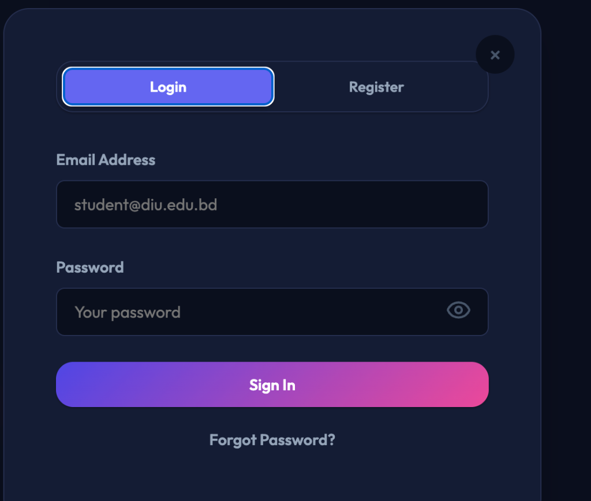
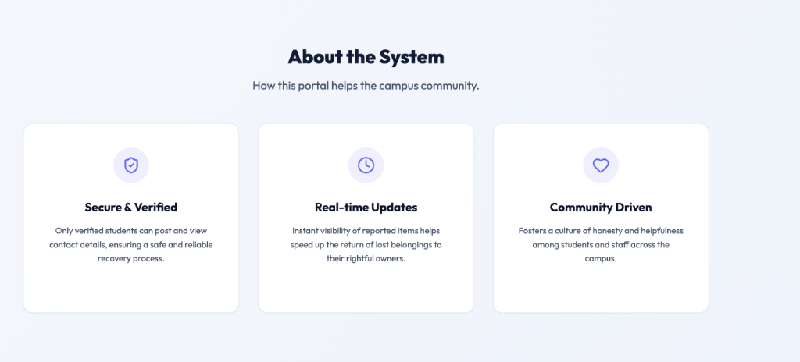

# University Lost & Found Portal

A professional and premium web application designed for university students and staff to report lost items and return found property within the campus community. Built with a robust Spring Boot backend and a modern, responsive frontend.

## 🌟 Key Features

### 🔐 Authentication & Security
- **Secure Sign In & Registration**: Students must authenticate using their university email (e.g., `@diu.edu.bd`).
- **OTP Verification**: Multi-factor authentication with verification codes for registration and password resets.
- **Forgot Password**: Self-service account recovery flow.

### 📋 Item Management
- **Report Lost/Found Items**: Easily submit details about items including title, location, description, and contact info.
- **Image Support**: Users can attach images of the items to help with identification.
- **Search & Filter**: Browse records with real-time filtering by type (Lost/Found).

### 🛡️ Admin Controls
- **Restricted Permissions**: Regular users cannot delete or edit posts (not even their own) to prevent tampering.
- **Dedicated Admin Portal**: Admins have exclusive access to delete resolved or invalid records.

### 🎨 Premium UI/UX
- **Default Dark Mode**: A sleek, modern dark theme active by default, with a toggle switch to light mode.
- **Vibrant Design**: High-contrast gradients (Indigo to Pink) for a premium feel.
- **Fully Responsive**: Optimized for mobile, tablet, and desktop viewports with a custom hamburger menu.

---

## 📸 Screenshots

### Hero Section & Navigation


### Secure Authentication


### About the System


---

## 🛠️ Technology Stack

### Backend
- **Java 17+**
- **Spring Boot 3.5.0**
- **Spring Data JPA** (Hibernate)
- **H2 Database** (File-based storage for easy local setup, previously MySQL)

### Frontend
- **HTML5** (Semantic structure)
- **Vanilla CSS3** (Custom properties, grid layouts, animations)
- **JavaScript** (ES6+, async/await for API calls)
- **Lucide Icons** (For modern iconography)

---

## 🚀 How to Run Locally

### Prerequisites
- Java 17 or higher installed.
- Maven (or use the included wrapper `./mvnw`).

### Steps
1. Clone the repository to your local machine.
2. Navigate to the project root directory.
3. Run the following command:
   ```bash
   ./mvnw spring-boot:run
   ```
4. Open your browser and navigate to `http://localhost:8080`.

---

## 📄 Note on Image Uploads
*The current simulation generates a random high-quality placeholder image via `picsum.photos` when a file is attached to bypass standard database string length limits. In a full production environment, this connects to a Cloudinary storage bucket.*

---
Developed by **Fateha Hossain Anushka**
